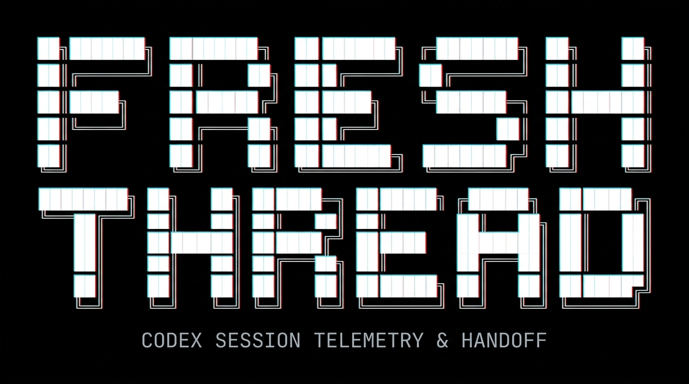
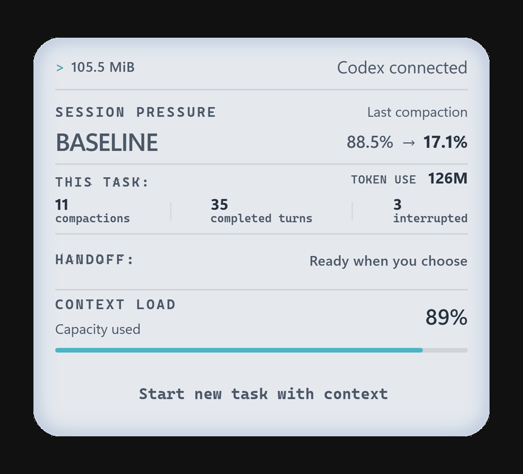

```text
        ███████╗██████╗ ███████╗███████╗██╗  ██╗   ████████╗██╗  ██╗██████╗ ███████╗ █████╗ ██████╗ 
        ██╔════╝██╔══██╗██╔════╝██╔════╝██║  ██║   ╚══██╔══╝██║  ██║██╔══██╗██╔════╝██╔══██╗██╔══██╗
        █████╗  ██████╔╝█████╗  ███████╗███████║      ██║   ███████║██████╔╝█████╗  ███████║██║  ██║
        ██╔══╝  ██╔══██╗██╔══╝  ╚════██║██╔══██║      ██║   ██╔══██║██╔══██╗██╔══╝  ██╔══██║██║  ██║
        ██║     ██║  ██║███████╗███████║██║  ██║      ██║   ██║  ██║██║  ██║███████╗██║  ██║██████╔╝
        ╚═╝     ╚═╝  ╚═╝╚══════╝╚══════╝╚═╝  ╚═╝      ╚═╝   ╚═╝  ╚═╝╚═╝  ╚═╝╚══════╝╚═╝  ╚═╝╚═════╝ 
```

<h3 align="center">Your sessions, finally visible. See the data behind your Codex work.</h3>

<p align="center">
  
  
  <a href="https://github.com/GG95-lab/FreshThread-app/releases"></a>
  <a href="https://github.com/GG95-lab/FreshThread-bridge"></a>
</p>

**Long Codex sessions can degrade after repeated compactions.**
FreshThread helps you see when a session is getting overloaded and move the important context into a fresh task without starting over.

**FreshThread is a Windows companion with a dedicated Codex plugin for tracking long sessions, compaction pressure, and carrying working context into fresh tasks.**

<blockquote>
<details>
<summary>💡 <strong>Codex Plugin Integration</strong></summary>

<p>FreshThread integrates with Codex through an MCP server, a skill, and lifecycle hooks for local session monitoring and handoff support.</p>
<p>The plugin is installed locally by the FreshThread Windows app and requires that app to work.</p>

</details>
</blockquote>

**[Download for Windows — Free Early Access (x64)](https://github.com/GG95-lab/FreshThread-app/releases/download/v0.2.8/FreshThread_0.2.8_x64-setup.exe)**

> [!IMPORTANT]
> FreshThread doesn’t yet have a Windows publisher signature. For transparency, the
> component that connects FreshThread to Codex and the network viewer are both
> [open source](https://github.com/GG95-lab/FreshThread-bridge), with
> [independently verifiable GitHub builds](https://github.com/GG95-lab/FreshThread-bridge/blob/main/VERIFY.md).
> You can review their code and verify the components included in your installation.

**Verify your download:** The [0.2.8 release notes](https://github.com/GG95-lab/FreshThread-app/releases/tag/v0.2.8)
show how to check the installer against GitHub's immutable release. The
[bridge and network viewer each have build verification](https://github.com/GG95-lab/FreshThread-bridge/blob/main/VERIFY.md).

Its panel shows available context usage, completed turns, compactions and handoff
readiness. A handoff summarizes your goal, constraints, completed work and next
steps. You review and approve it before moving to a new task.

[](https://www.youtube.com/watch?v=rbEC1oFzns4)

## Reading the panel

The panel updates live as you work, following the selected session as Codex
reports new activity and measurements.
It follows Codex's light or dark appearance, with the same layout in both modes.

### Size & context

| Indicator | What it tells you |
| :--- | :--- |
| **MiB** | **Accumulated size on disk** of this session's data, as last read. |
| **Session pressure** | **Overall session pressure**, expressed as a status. |
| **Last compaction** | Context usage **before → after** the latest compression. The right-hand value is the starting load for continued work. |
| **Context load** | **Current context occupancy**, as last measured. |

> **93.6% → 32.3%** means work resumed with **32.3%** of the context already
> occupied. A higher starting value leaves less room for new work.
> As the session grows, the model may also carry forward more details that are
> no longer useful to the current task.

### Session activity

| Counter | What it counts |
| :--- | :--- |
| **Compactions** | Recorded context compressions in this session. |
| **Completed turns** | Completed response cycles. Each can include several tool calls. |
| **Interrupted** | Response cycles recorded as interrupted, such as a stopped response. |
| **Token use** | Recorded token usage across completed and interrupted turns—not just the current context. |

### Continuing in a new task

| Status | What it tells you |
| :--- | :--- |
| **Handoff** | Whether the working context is ready to carry into a new task. **You choose when to start.** |

<p align="center">
  
  
</p>
<p align="center"><sub>The panel follows your Codex appearance setting: light, dark, or your system theme.</sub></p>

<table>
  <tr>
    <td width="50%" valign="middle">
      <h3>Make it yours</h3>
      <p>Customize your panel and symbol with a color that matches your taste or mood.</p>
      <p><sub>Tray menu → Panel &amp; symbol color…</sub></p>
    </td>
    <td width="50%" valign="middle" align="right">
      
    </td>
  </tr>
</table>

## Privacy in short

- **Local data.** FreshThread reads Codex session files on your PC and stores
  its own data locally.
- **Network access.** FreshThread checks for updates and their signed
  minimum-version policy. Bug reports are sent only when you choose.
- **Handoffs.** The context you approve, which may include text you wrote,
  is passed to a new task through Codex.
- **Bug reports.** Review before sending. Automatic diagnostics contain no
  conversations or code. Reports are kept for 30 days.

**See network activity yourself:** open **Network activity…** from the tray menu.
[How the viewer works](https://github.com/GG95-lab/FreshThread-bridge/blob/main/NETWORK.md).

---

<a name="free-early-access"></a>
<details name="freshthread-info">
<summary><strong>Free Early Access</strong></summary>

**Free Early Access is available, with no fixed expiry date.** Download the Windows x64 installer
from this repository's [Releases](https://github.com/GG95-lab/FreshThread-app/releases).
The main app's source code remains private. Its newer Codex connection is open
source: [FreshThread bridge](https://github.com/GG95-lab/FreshThread-bridge).

No FreshThread account is required. This is an early-access release, and features
may still change. Free Early Access does not promise lifetime free access or
include a future paid license.

Updates install automatically. A future signed minimum-version policy may require
an update to continue using the main features. Download or network errors alone
do not end access; an already-confirmed requirement remains in effect. Your local
data, reporting and the updater remain available. Any later paid version will
have its own terms. The old beta's fixed deadline does not apply to this version.

</details>

<details name="freshthread-info">
<summary><strong>Getting started</strong></summary>

1. [Download the Windows x64 installer](https://github.com/GG95-lab/FreshThread-app/releases/download/v0.2.8/FreshThread_0.2.8_x64-setup.exe).
2. Install it in the Windows account where you use Codex.
3. Review and enable the FreshThread hooks in **Codex Settings → Hooks**.
4. Open the FreshThread panel to view task activity or start a handoff.

Use local Windows tasks in the Codex MSIX app. WSL and remote tasks are not
supported by this build. Installation needs internet access if WebView2 is
missing, and administrator policies must permit the app and its hooks. If you
use `CODEX_HOME`, FreshThread and Codex must receive the same absolute path.
Beta 17 changes the hook definition, so Codex may ask you to review it again.

Automatic updates require separate signature verification; a download hash
alone does not prove who published a file.

The release includes [SHA256SUMS.txt](https://github.com/GG95-lab/FreshThread-app/releases/download/v0.2.8/SHA256SUMS.txt)
for checking the installer's hash and an updater signature. You can also
[verify the installer against GitHub's immutable release](https://github.com/GG95-lab/FreshThread-app/releases/tag/v0.2.8).
The separate public bridge and network viewer each have a
[build attestation and verification instructions](https://github.com/GG95-lab/FreshThread-bridge/blob/main/VERIFY.md).
On a successful uninstall, FreshThread removes its Codex integration and restores
the Codex settings it changed, leaving unrelated settings in place.

</details>

<details name="freshthread-info">
<summary><strong>What to test</strong></summary>

- Startup and hook setup.
- Tasks opened from Projects and Recents, task switching and empty tasks.
- Panel placement and proportions across resolutions and Windows scaling.
- Measurements after a completed turn, and handoffs using a disposable task
  without private content.
- Whether updates preserve settings and hooks. Avoid deliberately interrupting
  installation on your everyday computer.

Check release notes for known limitations. Report unexpected behavior even if
you find a workaround.

</details>

<details name="freshthread-info">
<summary><strong>Report a problem</strong></summary>

Open **FreshThread tray menu → Report a bug**. Choose **Something broke**, **Too
slow** or **Idea**. Optionally describe the issue, say whether it blocks your work,
or attach a screenshot. Review the image and the diagnostics under **Details**,
then choose **Send report** for a
private report. No account is needed, and nothing is uploaded until you send it.

Prefer GitHub? **Copy diagnostics** and **GitHub** remain available.
GitHub issues are public and require a GitHub account. Search existing issues,
then use **Issues → New issue → Bug report**. Include:

- FreshThread build, Codex version, Windows version and display scaling.
- Steps to reproduce the problem.
- What you expected and what happened.

Issues are public. Remove private information from screenshots and optional
diagnostics. Never upload conversations, databases, credentials, account
identifiers or raw diagnostic folders.

Report security vulnerabilities through
[private reporting](https://github.com/GG95-lab/FreshThread-app/security/advisories/new),
not public issues.

</details>

<details name="freshthread-info">
<summary><strong>Updates</strong></summary>

From 0.2.7-beta.1, installations check for signed updates at startup and every
five minutes. Automatic activation waits for FreshThread's own operations to
finish, including while Codex works. This release also preserves unsent report
descriptions, choices and optional screenshots locally through an update.
Older installed versions keep their existing check interval until updated.
New releases also
appear under [Releases](https://github.com/GG95-lab/FreshThread-app/releases).
Free Early Access has no fixed expiry date. A required upgrade is accepted only
from a cryptographically verified minimum-version policy.

Upgrading from beta.6 or earlier needs one Codex restart to load the new bridge.
After that, compatible app updates can reconnect in the background while Codex
stays open. FreshThread confirms when the updated connection is ready.

</details>

---

<sub>FreshThread is an independent tool for OpenAI Codex, not made or endorsed by OpenAI.<br>
The Codex pet belongs to OpenAI and only shows that FreshThread works with Codex.</sub>
